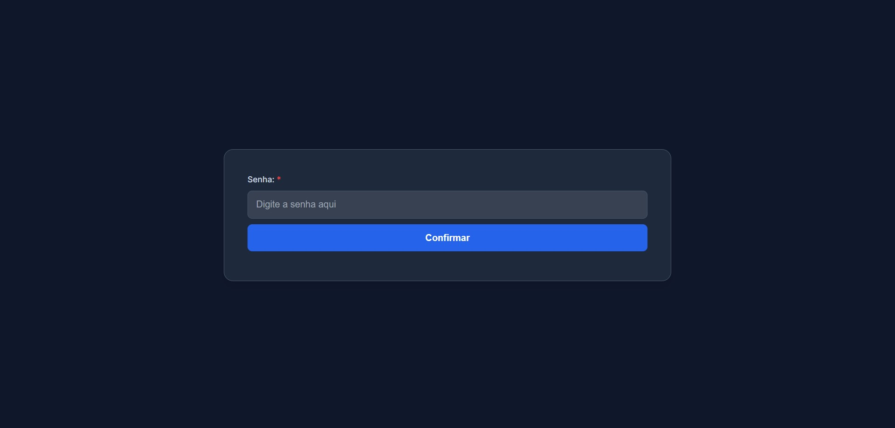
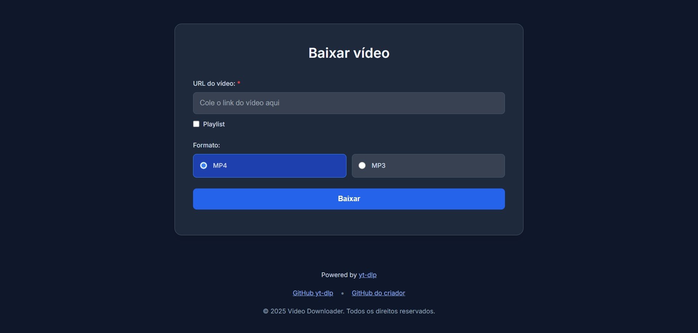
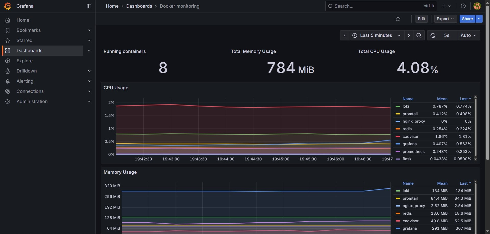

# Video Downloader Web App

Uma aplicação web para download de vídeos e áudios de URLs (incluindo playlists), com suporte a filas de tarefas via Redis, atualização de status em tempo real via WebSocket, download de arquivos processados, além de monitoramento com Prometheus, Grafana, Loki, Alloy e cAdvisor.

## Funcionalidades

* Download de vídeos ou áudios via `yt-dlp`
* Suporte a playlists
* Atualização de status em tempo real usando **Flask-SocketIO**
* Compactação automática em ZIP para playlists
* Armazenamento temporário de arquivos em `/app/files`
* Limpeza automática de pastas antigas
* Autenticação via token JWT
* Fila de downloads com Redis
* Proxy reverso com Nginx
* Monitoramento e métricas com Prometheus e cAdvisor
* Visualização de métricas e logs no Grafana
* Centralização de logs com Loki + Alloy

## Tecnologias

* Python 3.12
* Flask
* Flask-SocketIO
* Eventlet
* Redis
* yt-dlp
* Gunicorn
* Nginx
* Docker & Docker Compose
* Prometheus
* Grafana
* Loki
* Alloy
* cAdvisor

## Configuração

### 1. Variáveis de ambiente

Crie um arquivo `.env` com:

```dotenv
# Chave usada para assinar e validar JWTs
KEY_JWT=chave_super_secreta_jwt

# Senha usada para autenticação
CORRECT_PASSWORD=senha_forte_aqui

# Tempo de expiração do JWT em minutos
JWT_EXP_MINUTES=60

# Chave secreta para a aplicação (Flask SECRET_KEY)
SECRET_KEY=chave_super_secreta_app

# Tempo de expiração para links de arquivos (em minutos)
FILES_EXP_MINUTES=60

# Tempo de expiração dos dados no Redis (em segundos)
DATA_REDIS_EXP_SECONDS=3600

# Limite máximo de download em bytes (ex: 50MB = 52428800)
MAX_DOWNLOAD_BYTES=52428800

# Limite de requisições simultâneas com semáforo
SEMAPHORE_LIMIT=10

# Host do servidor Redis
REDIS_HOST=redis

# Porta do Redis
REDIS_PORT=6379

# Banco de dados Redis (numérico)
REDIS_DB=0

# Número de workers do Gunicorn (processos para lidar com requisições)
GUNICORN_WORKERS=4

# Usuário administrador do Grafana
GF_SECURITY_ADMIN_USER=admin

# Senha do usuário administrador do Grafana
GF_SECURITY_ADMIN_PASSWORD=senha_forte_grafana

# Nível de log do Grafana
GF_LOG_LEVEL=error # opções: debug=detalhado, info=padrão, warn=avisos+erros, error=apenas erros
```

### 2. Build & Run com Docker

```bash
docker-compose build
docker-compose up -d
```

## Serviços disponíveis

* **Aplicação Web**: [http://localhost:80](http://localhost:80)
* **Grafana**: [http://localhost:3000](http://localhost:3000)
* **Prometheus**: disponível em `http://prometheus:9090` na rede Docker interna
* **Loki**: disponível em `http://loki:3100` na rede Docker interna
* **cAdvisor**: disponível em `http://cadvisor:8080` na rede Docker interna

## Estrutura de diretórios

```
.
├── Dockerfile                  # Define a imagem Docker para a aplicação principal
├── docker-compose.yml          # Orquestra os contêineres Docker
├── requirements.txt            # Lista as dependências Python do projeto
├── main.py                     # Ponto de entrada da aplicação Flask
├── readme.md                   # Documentação do projeto
├── .env                        # Variáveis de ambiente
├── service/                    # Lógica de negócio (backend)
│   ├── __init__.py
│   ├── auth.py                 # Autenticação
│   ├── clean.py                # Limpeza automática
│   └── yt.py                   # Interação com YouTube (downloads)
├── web/                        # Interface do usuário (frontend)
│   ├── static/
│   │   ├── css/styles.css
│   │   ├── images/icon.svg
│   │   └── js/
│   │       ├── dev/auth.js
│   │       ├── dev/home.js
│   │       ├── auth.min.js
│   │       ├── home.min.js
│   │       └── socket.io.min.js
│   ├── auth.html
│   └── index.html
├── files/                      # Pasta temporária para downloads
├── images/                     # Capturas de tela da aplicação
│   ├── auth-page.jpg
│   ├── home-page.jpg
│   └── grafana-dashboards.jpg
└── infra/                      # Infraestrutura e monitoramento
    ├── grafana/provisioning/   # Provisionamento do Grafana
    │   ├── dashboards/
    │   │   ├── dashboards.yml
    │   │   └── docker-monitoring.json
    │   └── datasources/datasource.yml
    ├── nginx/nginx.conf        # Configuração do Nginx
    ├── prometheus/prometheus.yml # Configuração do Prometheus
    └── alloy/config.alloy     # Configuração do Alloy
```

## Endpoints da aplicação

### `/auth`

* `GET`: Página de login
* `POST`: Recebe JSON `{ "password": "senha" }` e retorna JWT em cookie HTTPOnly se correto

### `/initDownload`

* `POST`: Recebe JSON `{ "url": "...", "type": 1|2, "playlist": true|false }`
* Retorna `{ "uuid": "id_do_job" }`
* Processado em background via Redis

### `/download/<jobId>`

* Retorna o arquivo baixado

### WebSocket `/checkStatus`

* Recebe `{ "jobId": "..." }`
* Retorna status em tempo real

## Observações importantes

* Downloads são salvos em `/app/files/<uuid>/...`
* Playlists são compactadas em ZIP
* Limpeza automática remove pastas/arquivos que excederem o tempo definido em FILES_EXP_MINUTES (em minutos), verificando a cada 1 minuto
* `gunicorn` roda com Eventlet (`-k eventlet`) para suportar WebSocket
* Limite de downloads simultâneos definido por SEMAPHORE_LIMIT no .env
* Suporta apenas URLs do YouTube (`youtube.com` / `youtu.be`), conforme validação do regex presente em `/initDownload`
* Logs são coletados pelo **Alloy** e enviados ao **Loki**
* Métricas de containers e aplicação são expostas ao **Prometheus** e visualizadas no **Grafana**
* Os valores de Redis no `.env` (REDIS_HOST, REDIS_PORT, REDIS_DB) já correspondem aos padrões usados pelo container Redis do Docker Compose
* Os logs do Nginx registram apenas requisições bloqueadas (HTTP 429) e os limites de requisições (`limit_req`) e conexões (`limit_conn`) estão configurados no arquivo `nginx.conf`

## Interfaces

### Página de Login


### Página de Download de Vídeos


### Dashboard do Grafana

